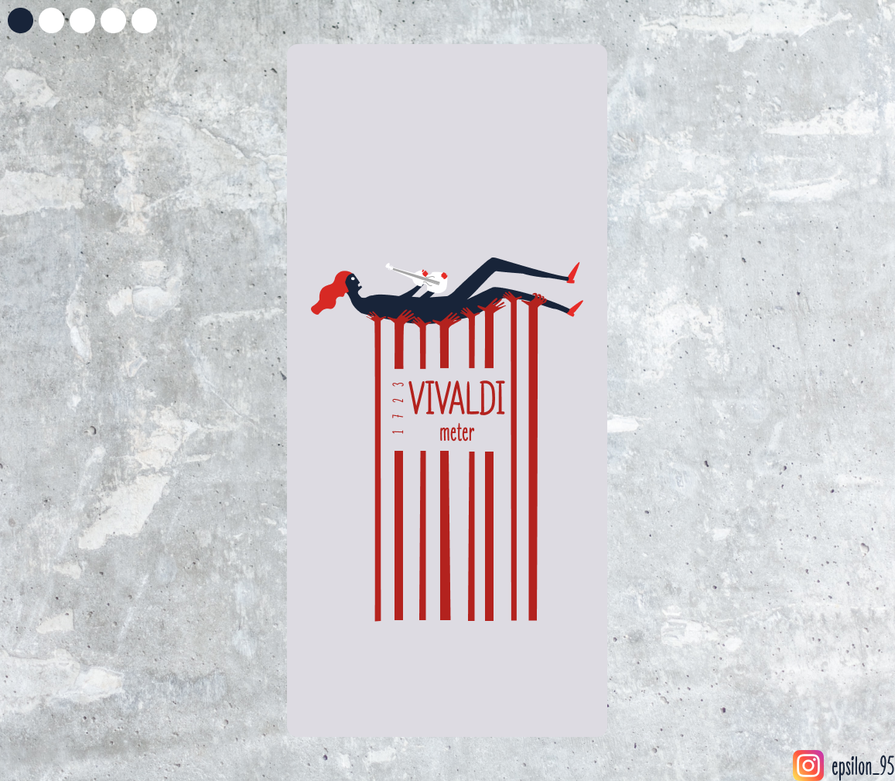

# ❤️ CodeWithFriends Fall 2020
 
 

# [Vivaldi Meter](https://play.google.com/store/apps/details?id=io.github.epsi95.vivaldimeter)

The Four Seasons is a group of four violin concerti by Italian composer Antonio Vivaldi, each of which gives musical expression to a season of the year.
Similarly we, human beings go through different moods everyday. Maybe your boss scolded you or your beloved one gifted you something. The mood you have today is the result of this cumulated experience.
In this app, you will record your mood with a sweet note or message every day. After some time you can look back and see how was your past days (ex: 70% bad day...). Also, there is a chat room with very sweet peoples, you can meet new friends there.

 

## What you can do in this app?
1. Record how your day was
2. Keep a note everyday
3. A chat room where you can share experience
4. Share your record with friends
5. See the statistics of your record

## What is the purpose of this app?
I see many people go through consecutive bad days which affect their mood and productivity. If they keep track of their past days then when it is too much, they will know now it is a time to take a break!

## How to use the app?

### 🕖 Record your mood

There are 4 seasons. Each represents different mood. Explore app to know. Press the corner green check-mark to record for today. Don't worry you can tap as many times as you want, each time old record of today will be overwritten (not the note). Best time to record is at the end of the day.
 

### 🗯 Chat room

Here you can meet new people. Just chill there when you have a bad day. Express your emotion, hope someone will make you happy!
 

### 🕵️ See statistics

Here you can set 7-DAY, 30-DAY or CUSTOM filter to see what is the percentage of mood. If you have more than 70% of Winter season, then my friend something is wrong with your life!
 

### ✍ Save Note for a day

Toggle to calender mode. Then long press on a particular date in the date range you selected, a popup will come. You change the field and then update.
 

### Share, Export or Contact me 😁

Click on share button if you want to share your stat! Otherwise take backup of your input  as a csv file and save it in secure place. Also found a bug🐛? Mail me!
 

-----